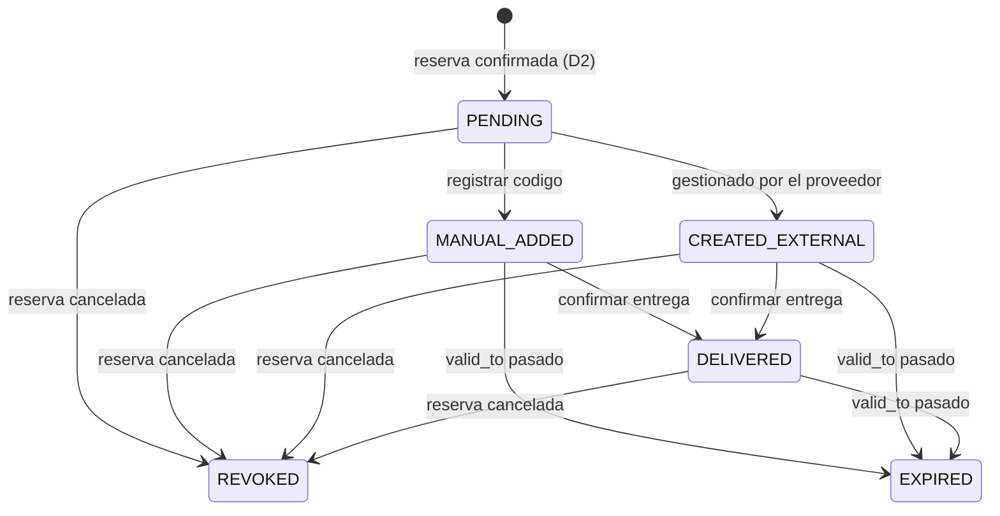

# Design: access-notifications

## Context

Las tres piezas existen a nivel de esquema y ninguna a nivel de comportamiento.

- **Acceso**: `backend/app/access/` tiene solo `domain/entities.py`, `domain/enums.py` e
  `infrastructure/models.py` — sin puertos, repositorio, casos de uso ni API. Los cuatro
  `TimelineEventType` de PRD §15 ya están declarados
  (`backend/app/timeline/domain/enums.py:28-31`) y no los escribe nadie.
- **Notificaciones**: `backend/app/notifications/` tiene entidad, enums, política de escalado
  (`domain/escalation.py`), el puerto `NotificationLogRepository` con `list_sla_breach_candidates`
  / `mark_breached` / `add`, su adaptador SQLAlchemy y el caso de uso
  `EscalateBreachedSlasUseCase`. **No hay puerto de envío ni adapter de canal.** El puerto declara
  literalmente que «sending is not here and will not be — the `NotificationAdapter` of PRD §14
  belongs to `access-notifications`» (`domain/repositories.py:5-7`).
- **Registro legal**: `backend/app/guests/` tiene entidad, enums (`LegalRegistrationStatus`,
  `GuestDocumentStatus`, `GuestDocumentType`), modelo con `document_number_encrypted` y un
  `GuestRepository` cuyas lecturas devuelven `GuestSummary` sin datos de documento
  (`domain/repositories.py:8-12`). Sin `application/` ni `api/`. `Reservation` lleva
  `access_status` y `legal_registration_status`, ambos declarados «owned by another module» y
  excluidos de `UPDATABLE_FIELDS` (`backend/app/reservations/domain/entities.py:16-20`) — ese
  módulo es este change.
- **El hueco que enciende todo**: `list_sla_breach_candidates` exige `status = SENT`
  (`notifications/infrastructure/repositories.py:37`) y el único escritor de
  `CLEANING_TASK_ASSIGNED` deja las filas en `PENDING` a propósito
  (`cleaning/domain/notifications.py:41-49`), así que hoy `check_sla_breaches` nunca tiene
  candidatos.

Infraestructura reutilizable: `app/scheduler/` (locks Redis por nombre de tarea, `CADENCES`,
`run_for_every_tenant`), `app/core/unit_of_work.py`, `app/core/crypto.py`,
`app/audit/domain/{actions,services,value_objects}.py` (`ChangeSet`, `AuditLogFactory`),
`app/timeline/domain/services.py` (`TimelineEventFactory`).

## Decisions

### D1 — `access_records` es la verdad; `reservations.access_status` es una proyección

**Chosen:** el estado del acceso vive en `access_records.status`. Los casos de uso que lo mueven
actualizan `reservations.access_status` **en la misma transacción**, como columna derivada para
que el dashboard no tenga que hacer join. Es exactamente la razón por la que `UPDATABLE_FIELDS`
la excluye del PATCH: nadie más la escribe.

`AccessRecordStatus.REVOKED` no tiene equivalente en `ReservationAccessStatus` (PRD §7.6 cierra
el enum en `PENDING, CREATED_EXTERNAL, MANUAL_ADDED, DELIVERED, EXPIRED, NOT_REQUIRED`) y **no se
amplía**: los nombres del PRD son canónicos. Se proyecta a `NOT_REQUIRED`, que es lo que
efectivamente aplica a una reserva cancelada — el único caso que produce `REVOKED` (R1.4).
Documentado como `ASSUMPTION` en el mapeo.

Rejected: dos fuentes independientes — divergen en cuanto una falla.
Rejected: usar solo `reservations.access_status` — pierde `code_masked`, `valid_from/to`,
`provider` y el historial que `access_records` existe para guardar.
Rejected: añadir `REVOKED` a `ReservationAccessStatus` — inventa un valor que el PRD cierra.

### D2 — Un reconciliador, no un hook en cada camino de confirmación

**Chosen:** un job Celery `provision_access_records` (cada 5 min, mismo patrón que los cuatro de
PRD §8.3) que, por tenant, crea el `AccessRecord` que falte a cada reserva confirmada, fija su
`legal_registration_status` inicial y revoca el de las canceladas. Idempotente por construcción
(R1.3): la condición de trabajo es «reserva confirmada **sin** registro».

Lo decisivo no es la elegancia: hay reservas **ya confirmadas** en la base de datos. Un hook en
la transición solo cubre las futuras y dejaría el histórico sin registro para siempre. Además,
las confirmaciones entran por tres caminos distintos (`UpdateReservationUseCase`, import CSV y
sync PMS, los dos últimos vía `ReservationStatus.parse_ingested`, que **por defecto confirma**),
y engancharlos uno a uno son tres sitios donde olvidarse.

Rejected: hook en `UpdateReservationUseCase` + los dos ingest — tres puntos de fallo y sin
backfill.
Rejected: trigger de base de datos — lógica de negocio fuera del dominio, invisible a los tests
de capa.

Coste aceptado: hasta 5 minutos de latencia entre confirmar y ver el registro. Irrelevante frente
a un check-in que ocurre días después.

### D3 — El emisor es un quinto job de beat, no un envío en línea

**Chosen:** `dispatch_notifications`, cada minuto, drena las filas `PENDING`. Los escritores
actuales dejan la fila en `PENDING` **a propósito** como costura entre encolar y entregar
(`notifications/domain/repositories.py:57-59`), y meter una llamada saliente dentro de la
transacción de negocio que crea la notificación acoplaría el commit de una limpieza al SMTP de un
tercero.

Divergencia declarada: PRD §8.3 nombra cuatro jobs y este es el quinto (sexto con D2). El PRD no
dice cómo se dispara el envío de §14; nombrar el job es una decisión de este change, no una
contradicción del PRD. Los nombres de los cuatro originales no se tocan.

Rejected: envío síncrono en el caso de uso — acopla la transacción a la red.
Rejected: `.delay()` por fila desde el escritor — pierde las filas escritas antes de este change y
duplica el mecanismo de reintento que la tabla ya modela con `attempts`.

### D4 — Semántica de entrega: at-least-once acotado, `attempts` antes del envío

**Chosen:** por cada fila, el job (1) incrementa `attempts` y **comitea**, (2) llama al adapter,
(3) escribe el resultado y comitea. Un proceso que muera entre (2) y (3) puede reenviar esa fila
en el siguiente tick, pero `attempts` ya está persistido, así que el tope de reintentos acota los
duplicados en vez de dejarlos sin límite.

No se marca `SENT` sin confirmación del adapter (R4.6). La exclusión mutua entre ejecuciones la da
el `task_lock` de Redis que ya usan los cuatro jobs (`app/scheduler/locks.py`), por nombre de
tarea y global — no hace falta un estado `SENDING` intermedio.

Rejected: estado `SENDING` en `NotificationStatus` — exige migración `ALTER TYPE` y deja filas
colgadas si el proceso muere en ese estado.
Rejected: commit único al final del lote — un fallo a mitad reenvía todo el lote.
Rejected: transacción distribuida — no existe con un `ConsoleEmailAdapter`.

Sin backoff exponencial: no hay columna donde guardar el próximo intento y añadirla para un
adapter de consola es especular. Se reintenta cada tick hasta `notification_max_attempts`
(default 3) y entonces `FAILED`.

### D5 — Registro de canales, y el `InAppNotificationAdapter` que no envía nada

**Chosen:** un `dict[NotificationChannel, NotificationAdapter]` construido en
`app/notifications/infrastructure/adapters.py`. `EMAIL` → `ConsoleEmailAdapter`, `WHATSAPP` →
`MockWhatsAppAdapter`, `IN_APP` → `InAppNotificationAdapter`, `CONSOLE` → `ConsoleEmailAdapter`.
`PUSH` **no tiene entrada**: R4.5 lo lleva a `SKIPPED`.

`InAppNotificationAdapter` no llama a nada y devuelve éxito: en el canal in-app **la fila es la
entrega**, y lo que la hace legible es el endpoint de lectura de D6. Sin ese endpoint, marcar
`SENT` sería afirmar una entrega inexistente — que es justo lo que este proyecto no hace.

Rejected: un adapter por canal resuelto por `getattr`/importación dinámica — invisible a mypy y a
los tests.

### D6 — La API de lectura in-app entra en el alcance

**Chosen:** `GET /api/v1/notifications` (paginado, solo las del usuario del token) y
`POST /api/v1/notifications/{id}/read`. PRD §14 define el canal in-app como «Notification entity +
API polling/SSE»; sin lectura, D5 marca `SENT` sobre nada. Polling, no SSE — SSE es infraestructura
de tiempo real que ninguna pantalla consume todavía.

Marcar como leída necesita una columna. **No se añade**: `read_at` no está en PRD §7.24 y este
change no tiene por qué inventarla. El endpoint de lectura devuelve las filas y el frontend lleva
su propio estado hasta que una entrada de roadmap decida lo contrario. Consecuencia: `POST
/{id}/read` **no se implementa** — solo `GET /api/v1/notifications`. (Ver OQ2.)

Rejected: no dar API de lectura — deja D5 marcando entregas que nadie puede leer.
Rejected: SSE — nadie lo consume y complica el despliegue detrás del ingress.

### D7 — Cerrar el SLA es anular el plazo, no marcarlo incumplido

**Chosen:** un método nuevo y estrecho en el puerto,
`cancel_sla_deadline(tenant_id, related_type, related_id, notification_type)`, que pone
`sla_deadline_at = NULL` en las filas que casan. Sale de la consulta de candidatos por la segunda
condición (`sla_deadline_at IS NOT NULL`) sin tocar `status`, `sla_breached`, `subject`, `body` ni
`recipient_contact` — la acotación que `mark_breached` documenta se mantiene.

Lo llaman `AcceptCleaningTaskUseCase` y `RejectCleaningTaskUseCase`
(`cleaning/application/use_cases.py:564,591`) con
`related_type = "cleaning_task"`, `related_id = task.id`,
`notification_type = CLEANING_TASK_ASSIGNED`. El índice
`ix_notification_logs_related_type_related_id` ya cubre esa forma exacta. Es idempotente y no
falla cuando no encuentra fila (R5.3) — a diferencia de `mark_breached`, aquí cero filas es el
caso normal: una tarea creada antes de este change no tiene plazo que anular.

Rejected: `sla_breached = True` — afirma un incumplimiento que no ocurrió y dispara el escalado.
Rejected: `status = SKIPPED` — miente sobre la entrega de una notificación que sí se envió.
Rejected: valor nuevo en `NotificationStatus` — migración para un hecho que la columna de plazo ya
expresa.

### D8 — `last_error` estructurado por construcción, no por disciplina

**Chosen:** el puerto `NotificationAdapter` devuelve un `NotificationResult` cuyo campo de error es
un **`NotificationErrorCode`** (enum cerrado: `ADAPTER_ERROR`, `INVALID_RECIPIENT`, `TIMEOUT`,
`NO_ADAPTER_FOR_CHANNEL`, `MAX_ATTEMPTS_EXCEEDED`), nunca un `str` libre. `last_error` se serializa
como `{"code": ..., "channel": ..., "attempt": n}`.

Es la aplicación de la regla 11 de `steering/security.md` a la única columna que este change
hereda como primer escritor. Que el tipo sea un enum es lo que impide que la excepción de un SDK
—que rutinariamente lleva incrustado el mensaje que no pudo enviar— acabe en la columna: el texto
del proveedor **no cabe** en el tipo de retorno. Mismo patrón que `ChangeSet` en `audit`.

Rejected: `str` con revisión en code review — la propia regla 11 documenta que la disciplina
repetida falló tres veces.

### D9 — El código de acceso en claro no se persiste, no se registra y no viaja

**Chosen:** `create_manual_access` recibe el código, deriva `****XX` con un helper puro de
`access/domain/masking.py`, persiste **solo** eso en `code_masked` y descarta el original. No hay
columna de texto plano en `AccessRecordModel` y no se añade. Las notificaciones al huésped llevan
la forma enmascarada — la única excepción que la regla 11 concede a `subject`/`body`.

Esto no rompe la operación: PRD §15 dice que AutoHostAI **no** controla la cerradura y que el
código lo genera y entrega el proveedor a través del PMS. `MANUAL_ADDED` registra que existe;
`DELIVERED` registra que el operador confirmó que el huésped lo tiene. La entrega del valor real
es fuera de banda, por diseño.

Rejected: cifrar el código con Fernet — la regla 3 lo permitiría, pero descifrarlo requiere un
consumidor, y no hay ninguno: nadie en el MVP necesita el valor.

### D10 — `reservations.legal_registration_status` es la verdad; el de `guests` no se escribe

**Chosen:** el flujo de PRD §17 es **por estancia** («al confirmar reserva…»), así que su estado
vive en la reserva. `guests.legal_registration_status` se deja en `NOT_REQUIRED` y **este change no
lo escribe**: un huésped con dos estancias tendría dos valores y una sola columna. Lo que sí
describe al huésped es `guests.document_status`, que este change sí mueve
(`NOT_PROVIDED → PROVIDED`) al recibir los datos.

Se declara explícitamente en la spec para que el siguiente no lo lea como olvido. `guest-portal-api`
puede revisarlo cuando traiga la captura por el huésped.

Rejected: escribir ambas — dos fuentes que divergen en cuanto un huésped repite estancia.

### D11 — Los datos de documento entran por un endpoint propio, cifrado y auditado

**Chosen:** `guests` gana `application/` y `api/` con dos operaciones:
`PATCH /api/v1/guests/{id}/document` (escribe `nationality`, `date_of_birth`, `document_type`,
`document_number`, `document_expiry_date`; cifra el número con `app/core/crypto.py`) y
`GET /api/v1/guests/{id}/document` (devuelve el número descifrado). Ambas escriben `AuditLog`
—regla 9 nombra «acceso/modificación de documentos de Guest» y la lectura es acceso— con
`ChangeSet` que registra **qué campos** cambiaron, nunca sus valores (regla 11 sobre
`audit_logs.changes`, cuyo contrato fijó `user-management`).

R6.3 (`READY_TO_SUBMIT`) se evalúa en un servicio puro de dominio sobre la unión de
huésped + reserva: `check_in_date`/`check_out_date` son de la reserva, no del huésped.

Rejected: aceptar los datos en el PATCH genérico de la reserva — pondría PII en el camino que
`OPAQUE_IN_TIMELINE` y `UPDATABLE_FIELDS` diseñaron precisamente para no tenerla.

### D12 — Los adapters manuales/mock viven en su dominio; los de proveedor externo, en `integrations/`

**Chosen:** `AccessProviderAdapter` y `SESHospedajesAdapter` se declaran en el `domain/ports.py`
de `access` y `guests`. `ManualAccessAdapter`, `MockAccessAdapter` y `MockSESHospedajesAdapter`
viven en el `infrastructure/` de su dominio, porque no hablan con ningún sistema externo. El día
que lleguen GrinPass/TTLock o Chekin, sus adapters van a `app/integrations/`, donde ya viven los
de PMS.

Rejected: todo en `integrations/` — un adapter «manual» no integra con nada.

### D13 — RBAC y aislamiento con los patrones que ya existen

**Chosen:** el rol se deriva del token dentro del caso de uso, nunca de la petición — patrón
`CleaningActor.restrict_to_cleaner_id` (`cleaning/application/use_cases.py:442-450`). Referencia
cruzada de tenant → `404` idéntico al inexistente, como en `cleaning` R7.3.

Reparto efectivo de los cinco permisos nuevos (`backend/app/auth/domain/policy.py`):

| Permiso | `TENANT_OWNER` | `PROPERTY_MANAGER` | `CLEANER` / `TECHNICIAN` | `SUPER_ADMIN` |
|---|---|---|---|---|
| `READ_OWN_NOTIFICATIONS` | ✔ | ✔ | ✔ | ✔ |
| `READ_ACCESS_RECORDS` | ✔ | ✔ | — | — |
| `MANAGE_ACCESS_RECORDS` | — | ✔ | — | — |
| `READ_GUEST_DOCUMENTS` | ✔ | ✔ | — | — |
| `MANAGE_GUEST_DOCUMENTS` · `SUBMIT_LEGAL_REGISTRATION` | — | ✔ | — | — |

**Dos correcciones sobre la primera redacción de esta decisión**, hechas al implementar y
recogidas aquí porque el arquitecto las encontró en el panel de feature: decía «escritura de
accesos y submission legal: `SUPER_ADMIN`, `TENANT_OWNER`, `PROPERTY_MANAGER`», y no es lo que se
construyó.

1. **El owner lee y no opera.** PRD §6 le da «ver sus propiedades y reservas» y al manager «acceder
   a todos los datos operativos»; el mismo corte que `reservations` y `properties-crud` ya
   hicieron. Registrar el código y presentar a SES.Hospedajes son operación.
2. **`SUPER_ADMIN` no recibe ninguno**, ni siquiera `READ_GUEST_DOCUMENTS`, que PRD §17 sí le
   nombra. Esa frase del PRD es un **techo** —dice quién *puede* ver un documento— y esta tabla
   sigue decidiendo quién lo hace. `SUPER_ADMIN` no tiene rol operativo dentro de un tenant en
   ninguna parte del sistema: sus poderes de PRD §6 son globales y la visibilidad cross-tenant está
   explícitamente aplazada a `saas-cross-tenant`. Conceder aquí sería pre-decidir esa entrada, y
   los documentos de identidad son el peor sitio posible para hacerlo. **No se incumple §17**:
   ningún rol fuera de sus tres ve un documento, y retirar es más estrecho que el techo.

Rejected: seguir la enumeración de §17 al pie de la letra y dar `READ_GUEST_DOCUMENTS` a
`SUPER_ADMIN` — abriría la puerta cross-tenant que `saas-cross-tenant` existe para decidir, sobre
el dato más sensible del sistema.

### D14 — Máquina de estados de `AccessRecord`

Transiciones admitidas; cualquier otra es `409` (R2.5):



La invariante vive en la entidad `AccessRecord` (métodos `register_manual_code`,
`mark_external_managed`, `mark_delivered`, `revoke`), no en el caso de uso — es una regla de
negocio, y `steering/backend-architecture.md` es explícito. `EXPIRED` lo aplica el reconciliador
de D2 cuando `valid_to` ha pasado; hoy nada rellena `valid_to`, así que la transición existe y no
se ejercita — se declara para no dejar el enum con un valor sin camino.

## Changes by area

| Area | Files | Change |
|---|---|---|
| access/domain | `entities.py`, `enums.py` (existen); **nuevos** `ports.py`, `repositories.py`, `exceptions.py`, `masking.py` | Métodos de transición en `AccessRecord` (D14), puerto `AccessProviderAdapter`, puerto `AccessRecordRepository`, helper `mask_access_code` |
| access/infrastructure | `models.py` (existe); **nuevos** `repositories.py`, `adapters.py` | `SqlAlchemyAccessRecordRepository`, `ManualAccessAdapter`, `MockAccessAdapter` |
| access/application | **nuevo** `use_cases.py` | `RegisterManualAccessCodeUseCase`, `MarkAccessExternallyManagedUseCase`, `MarkAccessDeliveredUseCase`, `ListAccessRecordsUseCase`, `GetAccessRecordUseCase`, `ProvisionAccessRecordsUseCase` (D2) |
| access/api | **nuevos** `router.py`, `schemas.py`, `dependencies.py`, `errors.py` | Endpoints de R3 |
| notifications/domain | `entities.py`, `enums.py`, `repositories.py` (existen); **nuevos** `ports.py`, `results.py` | `NotificationAdapter`, `NotificationResult`, `NotificationErrorCode` (D8); `cancel_sla_deadline` y `list_pending` en el puerto de repositorio |
| notifications/infrastructure | `repositories.py`, `models.py` (existen); **nuevo** `adapters.py` | Implementación de los dos métodos nuevos; `ConsoleEmailAdapter`, `MockWhatsAppAdapter`, `InAppNotificationAdapter`, registro de canales (D5) |
| notifications/application | `use_cases.py` (existe) | **añade** `DispatchPendingNotificationsUseCase` (D3, D4) y `ListOwnNotificationsUseCase` (D6) |
| notifications/api | **nuevos** `router.py`, `schemas.py`, `dependencies.py` | `GET /api/v1/notifications` (D6) |
| guests/domain | `entities.py`, `enums.py`, `repositories.py` (existen); **nuevos** `ports.py`, `legal_registration.py`, `exceptions.py` | `SESHospedajesAdapter`, `SubmissionResult`; servicio puro de readiness (D11); métodos de documento en `Guest` |
| guests/infrastructure | `models.py`, `repositories.py` (existen); **nuevo** `adapters.py` | Lectura/escritura de documento cifrado; `MockSESHospedajesAdapter` |
| guests/application, guests/api | **nuevos** | `SetGuestDocumentUseCase`, `ReadGuestDocumentUseCase`, `SubmitLegalRegistrationUseCase`; routers de R6/R7 |
| cleaning/application | `use_cases.py` | `AcceptCleaningTaskUseCase` y `RejectCleaningTaskUseCase` reciben `NotificationLogRepository` y llaman `cancel_sla_deadline` (D7, R5) |
| cleaning/api | `dependencies.py` | Inyecta el repositorio nuevo en esos dos casos de uso |
| reservations | `application/use_cases.py` | Proyección de `access_status` no se toca aquí: la escribe el módulo de acceso en su propia transacción (D1) |
| scheduler | `tasks.py`, `schedule.py` | Dos tareas nuevas: `dispatch_notifications` (1 min) y `provision_access_records` (5 min) |
| audit | `domain/actions.py` | Constantes nuevas: `ENTITY_ACCESS_RECORD`, `ENTITY_GUEST`, y acciones `ACCESS_CODE_REGISTERED`, `ACCESS_MARKED_EXTERNAL`, `ACCESS_DELIVERED`, `ACCESS_REVOKED`, `GUEST_DOCUMENT_UPDATED`, `GUEST_DOCUMENT_READ`, `LEGAL_REGISTRATION_SUBMITTED` |
| core | `config.py` | `notification_max_attempts: int = 3`, `notification_batch_size: int = 100` |
| main | `main.py` | Registro de los routers nuevos |
| alembic | **nueva** migración | Solo si el reconciliador necesita un índice para su consulta (ver *Data & interfaces*) |

## Data & interfaces

**Esquema**: ninguna tabla nueva, ningún enum ampliado. Las seis tablas implicadas
(`access_records`, `notification_logs`, `guests`, `reservations`, `audit_logs`, `timeline_events`)
ya existen con todas sus columnas.

Una migración **posible** y a confirmar en implementación: la consulta del reconciliador de D2
busca reservas confirmadas sin `AccessRecord`, y `ix_access_records_reservation_id` ya existe, así
que el `NOT EXISTS` está cubierto por ese lado; falta comprobar si `reservations` tiene índice
utilizable por `(tenant_id, status)`. Si no lo tiene, la migración lo añade.

**Puertos nuevos** (firmas, no implementación):

```python
class NotificationAdapter(Protocol):
    async def send(self, *, recipient_contact: str, subject: str | None,
                   body: str | None, channel: NotificationChannel) -> NotificationResult: ...

class AccessProviderAdapter(Protocol):
    async def get_access_status(self, reservation_external_id: str) -> AccessStatusResult: ...
    async def create_manual_access(self, *, record: AccessRecord, code: str,
                                   notes: str | None) -> AccessRecord: ...
    async def mark_external_managed(self, *, record: AccessRecord,
                                    notes: str | None) -> AccessRecord: ...

class SESHospedajesAdapter(Protocol):
    async def submit_guest(self, *, submission: LegalSubmission) -> SubmissionResult: ...
    async def get_submission_status(self, external_id: str) -> SubmissionStatus: ...
```

`NotificationAdapter.send` es `async` aunque PRD §14 lo declare síncrono: todo el backend es
async y un adapter SMTP real bloquearía el loop. La firma de PRD §14 se respeta en argumentos y
semántica.

**API nueva** (`/api/v1`, convenciones de PRD §23):

| Método | Ruta | Permiso | Quién lo tiene |
|---|---|---|---|
| GET | `/access-records` (filtros `reservation_id`, `property_id`, `status`) | `READ_ACCESS_RECORDS` | owner, manager |
| GET | `/access-records/{id}` | `READ_ACCESS_RECORDS` | owner, manager |
| POST | `/access-records/{id}/manual-code` | `MANAGE_ACCESS_RECORDS` | manager |
| POST | `/access-records/{id}/external` | `MANAGE_ACCESS_RECORDS` | manager |
| POST | `/access-records/{id}/delivered` | `MANAGE_ACCESS_RECORDS` | manager |
| GET | `/notifications` (las del usuario del token) | `READ_OWN_NOTIFICATIONS` | cualquier rol autenticado |
| PATCH | `/guests/{id}/document` | `MANAGE_GUEST_DOCUMENTS` | manager |
| GET | `/guests/{id}/document` | `READ_GUEST_DOCUMENTS` | owner, manager |
| POST | `/reservations/{id}/legal-registration/submit` | `SUBMIT_LEGAL_REGISTRATION` | manager |

**No hay herencia por jerarquía.** La tabla de D13 es el reparto completo: `SUPER_ADMIN` no
aparece en ninguna de estas rutas, y el owner lee sin operar. Una redacción anterior de esta
sección decía «`SUPER_ADMIN` y `TENANT_OWNER` incluidos en todas por jerarquía», que nunca fue
cierto en este proyecto — `ROLE_PERMISSIONS` es un mapa explícito por rol, no una cadena.

**Config**: `NOTIFICATION_MAX_ATTEMPTS` (3) y `NOTIFICATION_BATCH_SIZE` (100) en `.env.example`.
Ningún secreto nuevo — los adapters son consola y mock (regla 8).

**Beat**: `CADENCES` gana `dispatch_notifications: 1 min` y `provision_access_records: 5 min`.

## Risks & mitigations

- **Encender el escalado de SLA sobre datos ya existentes.** En cuanto el emisor marque `SENT`,
  las filas `CLEANING_TASK_ASSIGNED` con plazo ya vencido pasan a ser candidatas y
  `check_sla_breaches` escalará todas de golpe en el primer tick. *Mitigación*: el emisor solo
  marca `SENT` las que entrega, y una fila entregada hoy tiene un plazo de `creación + 240 min`;
  las creadas hace más de eso escalarán inmediatamente. Es **correcto** —el plazo se incumplió de
  verdad— pero puede generar una avalancha en el primer despliegue. Se verifica en `run` contra
  los datos de dev y se anota; si el volumen molesta, la salida es un `sla_deadline_at` en el
  pasado que el emisor deja como está, no un filtro que oculte incumplimientos reales.
- **Duplicados de entrega** (D4). Acotados por `attempts`; con adapters de consola y mock el daño
  es una línea de log repetida. Se revisará antes de conectar un SMTP real.
- **`cancel_sla_deadline` sobre varias filas.** Si un día una tarea acumula dos filas de
  asignación, el método anula ambas — deseable. `cleaning` ya garantiza que responder no escribe
  una segunda.
- **PII en el camino nuevo** (R7). Tres puntos: el `ChangeSet` de `AuditLog` (contrato ya cerrado
  por `user-management`), el `last_error` (cerrado por construcción en D8) y los esquemas Pydantic
  de salida. El tercero es el único que depende de revisión: `GuestSummary` ya excluye documento
  estructuralmente y los esquemas nuevos deben partir de él, no de `Guest`.
- **Regla 12 (webhooks sin firma)**: no aplica en este change porque no se implementa ningún
  webhook — los de Chekin llegan con la integración real, que está fuera de alcance. Se deja dicho
  en la spec para que el siguiente no crea que ya está resuelto.
- **Volumen de `AuditLog` del reconciliador**: una fila por acceso creado, una sola vez por
  reserva. No es el patrón repetitivo que la segunda excepción de la regla 9 acota.

## Open questions — **resueltas con Jose el 2026-08-08**

Las cinco se plantearon con un default tomado e implementado; se confirmaron al cerrar
`/sdd:review`, así que aquí quedan como decisiones y no como preguntas. `BLOCKED.md` está vacío.

- **OQ1 — la API de lectura in-app entra en el alcance.** Confirmado. Sin ella, D5 marcaría `SENT`
  filas que nadie puede leer, que es una afirmación falsa. El proposal no la enumeraba; la
  ampliación es deliberada.
- **OQ2 — no se añade `read_at`.** Confirmado. El ciclo in-app queda a medias a propósito —se
  listan, no se acusan— porque PRD §7.24 no declara la columna y este proyecto trata sus nombres
  como canónicos. Inventar esquema para cerrar el ciclo es peor que dejar el hueco nombrado.
- **OQ3 — se acepta la avalancha del primer tick.** Confirmado, y **medido**: la relación es
  **1:1** (7 filas de plazo vencido → 0 candidatas antes del emisor, 7 después, `breached=7`).
  Son incumplimientos que ocurrieron de verdad; filtrarlos sería mentir sobre el pasado. El total
  de dev no es medible desde un worktree (base vacía); antes de desplegar se sabe con
  `SELECT count(*) FROM notification_logs WHERE notification_type = 'CLEANING_TASK_ASSIGNED'
  AND status = 'PENDING' AND sla_deadline_at < now()`.
- **OQ4 — `EXPIRED` se implementa aunque nadie rellene `valid_to`.** Confirmado. La alternativa
  era dejar un valor del enum sin camino. `test_expirable_finds_nothing_because_nothing_writes_valid_to`
  fija la ausencia y empezará a fallar, útilmente, el día que un proveedor real llene la columna.
- **OQ5 — `access_records.notes` NO entra ahora en la tabla de sumideros de la regla 11.**
  Confirmado: se deja para `field-apps`, que es quien ampliará la superficie de `notes` cuando la
  limpiadora vea accesos. Lo que este change sí hace es rechazar la petición cuando el código
  aparece en las notas —normalizando caja y separadores, tras dos rondas del panel—, que cierra el
  caso del operador descuidado. El caso general (escribir *otro* código más tarde) no lo puede
  cerrar ninguna comprobación dentro de la petición, y ampliar el contrato de un sumidero es una
  decisión de steering que la propia regla 11 dice cómo se toma. Anotado en la entrada de roadmap
  de `field-apps`.
